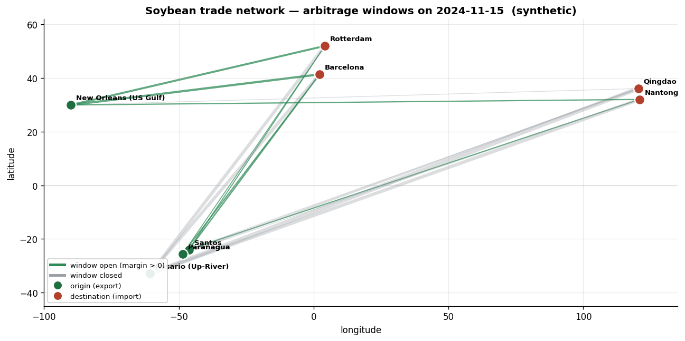
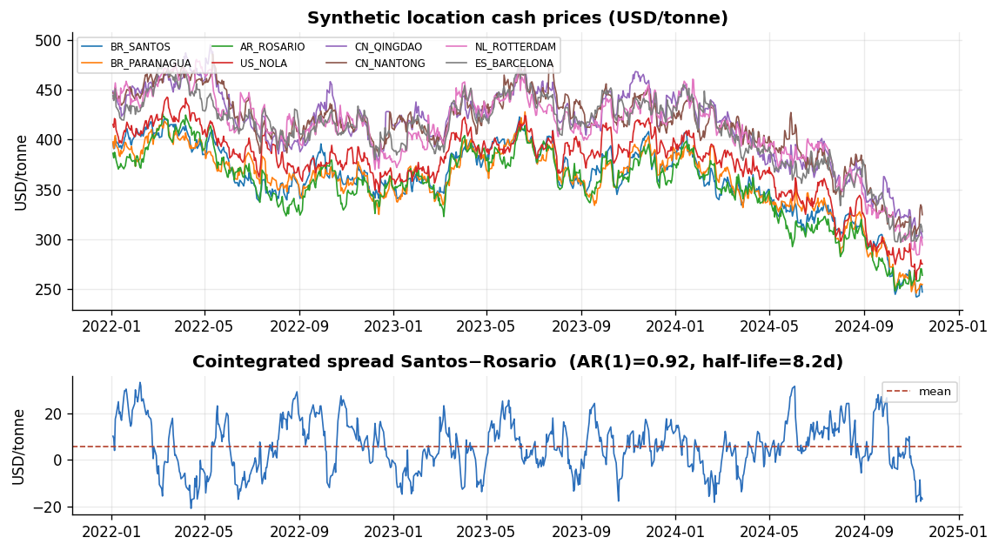
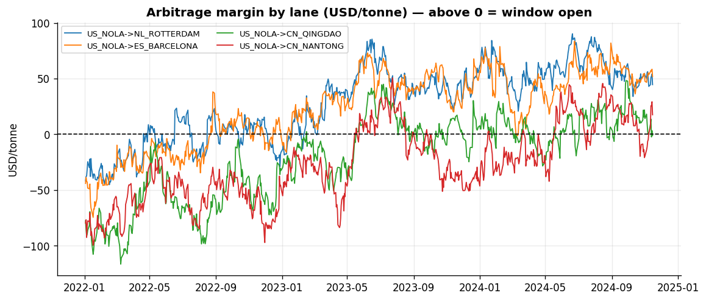
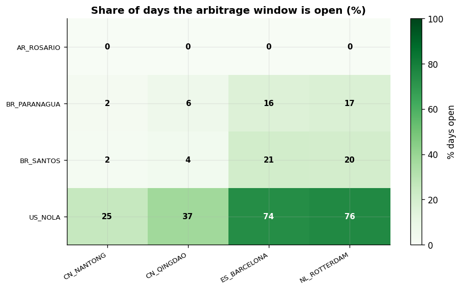
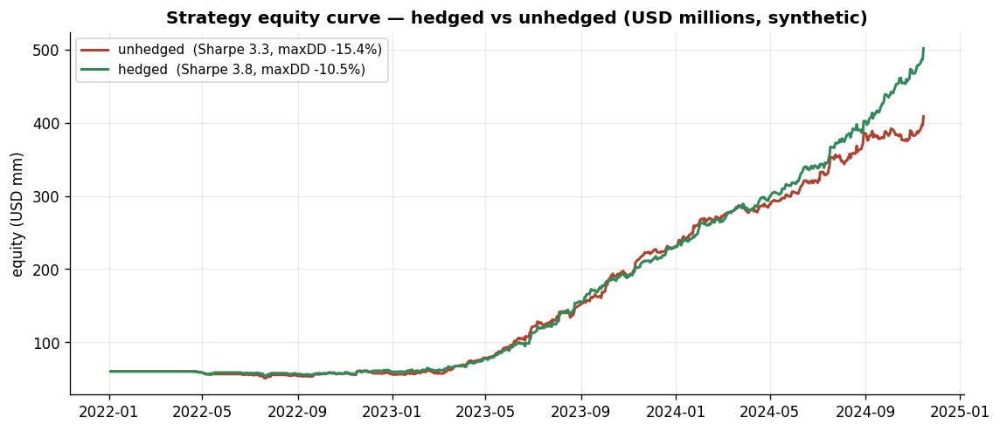

# 🌍 spatial-commodity-arbitrage

> A research toolkit for studying **spatial (geographic) arbitrage** in physical
> commodity markets — buying a commodity where it is cheap and selling it where
> it is dear, the core activity of trading houses like Bunge, Cargill and ADM.
>
> ⚠️ **Everything here runs on synthetic data.** It is an educational laboratory,
> not market data, and **not investment advice.**


---

## What is geographic arbitrage?

The same tonne of soybeans is worth different amounts in Santos, Rotterdam and
Qingdao. A trader can capture the difference — **but only if** the price gap
exceeds the full cost of moving the cargo: freight, port handling, tariffs,
financing the cargo while it is at sea, and the risk that prices move during the
voyage.

The **spatial Law of One Price** says regional prices can differ only up to the
transfer cost between them:

```
P_dest  −  P_origin/FX   ≤   handling + freight + tariff + financing
                         └──────────── the "no-arbitrage band" ────────────┘
```

When the left side pokes above the right side, the **arbitrage window is open** —
a trade signal. Acting on it pushes prices back into the band.



*Green lanes = arbitrage window open (a positive margin); grey lanes = closed.
Line width scales with the size of the margin. All values synthetic.*

---

## 📊 What the simulation shows

**Synthetic prices share a common world factor, so regional spreads are
cointegrated and mean-revert** — the statistical signature of the Law of One Price:



**The arbitrage margin per lane.** Above the dashed zero line the window is open;
most lanes spend much of their time *below* it because moving cargo is expensive:



**How often each lane's window is actually open.** Short, cheap lanes are open
most of the time; long or tariffed lanes only on favourable shocks:



**Back-test: hedging flat price with futures** removes random-walk price risk and
leaves the mean-reverting spatial/basis spread — lower volatility, smaller
drawdown:



> The interactive versions (folium map + plotly dashboard) and CSV panels are
> generated into `outputs/` by `make sim` and are **not committed** to the repo
> — run it locally and open the HTML in a browser. The static PNGs above are
> produced by `make figures`.

---

## ✨ Features

- 🗺️ **Interactive flow maps** (folium) + static PNG maps for the README
- 📈 **Plotly dashboard** — prices, per-lane margins, equity curve in one HTML
- 🔥 **Window heatmap** — share of days each lane's window is open
- 🧮 **Rigorous synthetic DGP** — cointegrated prices via a common world factor;
  mean-reverting freight & basis; random-walk FX
- ⚖️ **Spatial price equilibrium** — Takayama–Judge transportation LP (SciPy/HiGHS);
  dual variables are equilibrium location prices
- 💹 **Back-testable simulator** — books cargoes when windows open, ships them with
  realistic transit lags, optionally **hedges flat price with futures**
- 📄 **A rigorous paper** (`paper/`) deriving all the maths
- ✅ **Test suite** (`pytest`)

---

## 🚀 Quickstart

```bash
git clone https://github.com/pyoolo/spatial-commodity-arbitrage.git
cd spatial-commodity-arbitrage
pip install -r requirements.txt
pip install -e .

python scripts/run_simulation.py   # → interactive maps + dashboard in ./outputs/
python scripts/make_figures.py     # → static PNG charts in ./assets/
```

Programmatic use:

```python
from geoarb import (build_default_network, SyntheticDGP, DGPConfig,
                    ArbitrageEngine, ArbitrageSimulator, SimConfig,
                    performance_summary)

locations, routes = build_default_network()
data = SyntheticDGP(DGPConfig(n_days=750, seed=42)).generate()

arb = ArbitrageEngine(locations, routes).compute(data)
print(ArbitrageEngine.window_stats(arb).round(2))      # which lanes pay?

sim = ArbitrageSimulator(SimConfig(hedge_with_futures=True))
out = sim.run(arb, data["futures"])
print(performance_summary(out["equity"], out["trades"], 60_000_000))
```

---

## 🧱 Project structure

```
spatial-commodity-arbitrage/
├── geoarb/                     # the package
│   ├── geography.py            # ports, lanes, great-circle distances, freight
│   ├── dgp.py                  # synthetic data-generating process
│   ├── arbitrage.py            # delivered cost + arbitrage-window engine
│   ├── equilibrium.py          # Takayama–Judge spatial price equilibrium LP
│   ├── simulator.py            # event-driven trading simulator (+ futures hedge)
│   ├── metrics.py              # performance + cointegration diagnostics
│   └── viz.py                  # folium maps + plotly dashboard
├── scripts/
│   ├── run_simulation.py       # end-to-end demo → outputs/*.html
│   └── make_figures.py         # static PNG charts → assets/*.png
├── notebooks/walkthrough.ipynb # guided, runnable walkthrough
├── paper/                      # LaTeX source + compiled PDF of the maths
├── assets/                     # PNG charts shown in this README
├── tests/                      # pytest suite
└── outputs/                    # generated interactive HTML + CSVs
```

---

## 📐 The mathematics (one-paragraph tour)

Each location price is a **common world trend** `F_t` (random walk) plus a
location intercept plus a **stationary idiosyncratic spread**:
`P_k,t = F_t + a_k + u_k,t`. Because every location shares the same `F_t`, any
pair of regional prices is **cointegrated** — their *spread* is stationary and
mean-reverts. The **delivered cost** adds freight, handling, tariff and the
financing of capital tied up in transit; the **arbitrage margin** is destination
price minus delivered cost. The world trend cancels out of the margin, so the
long-run probability the window is open is approximately
`Φ(mean_margin / sd_margin)`. With many origins and destinations competing under
capacity limits, the equilibrium flows solve a **transportation LP** whose **dual
variables are the equilibrium location prices** (Takayama–Judge / Samuelson).
Finally, **selling futures against a long cargo cancels the random-walk
flat-price risk**, leaving the mean-reverting spatial/basis spread.

Full derivations and proofs: [`paper/geographic_arbitrage.pdf`](paper/geographic_arbitrage.pdf).

---

## ⚠️ Important caveats

The simulator still reports flattering Sharpe ratios (~4 with mark-to-market
equity). **That is an artefact of an idealised world**, not a claim about
reality. The lab deliberately omits execution slippage, market impact, lumpy
vessel availability, counterparty & demurrage risk, margin calls on the futures
leg, and the limited predictability of real basis. Restoring any of these
compresses returns toward the thin, hard-won margins of the real
physical-trading business. The point of the toolkit is **structural clarity**,
not return forecasting.

`make sim` runs the strategy both **hedged and unhedged** side by side so the
effect of the futures hedge is visible directly: it trims drawdown and lifts the
win rate by stripping out flat-price risk, leaving the mean-reverting spatial
spread the trader is actually long. Equity is **marked to market** daily (open
cargoes are revalued at the current lane margin, not frozen at cost), so the
volatility and drawdown figures reflect in-transit risk rather than settlement
jumps.

---

## 📚 References

1. Takayama & Judge (1971), *Spatial and Temporal Price and Allocation Models*.
2. Samuelson (1952), *Spatial Price Equilibrium and Linear Programming*, AER.
3. Engle & Granger (1987), *Co-integration and Error Correction*, Econometrica.
4. Pirrong (2014), *The Economics of Commodity Trading Firms*.
5. Working (1949), *The Theory of Price of Storage*, AER.

## License

MIT — see [LICENSE](LICENSE). Synthetic data only; not investment advice.
